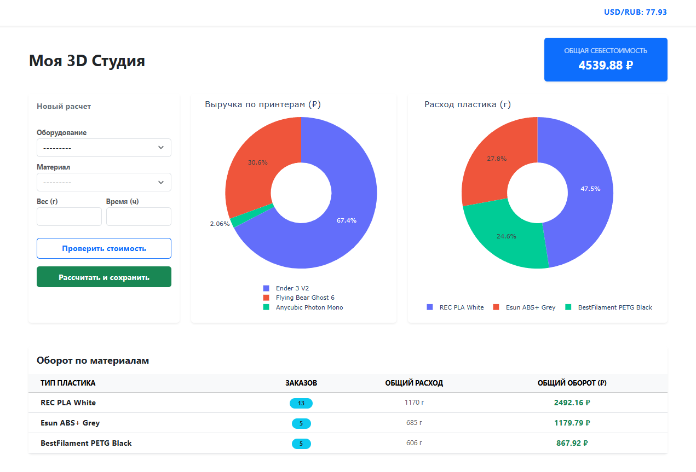
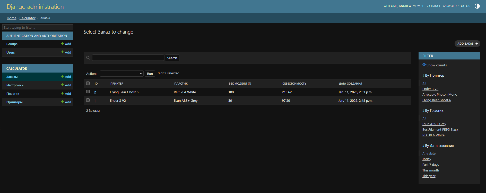

# 3D-Print Calculator

**3D-Print Calculator** — это профессиональное веб-решение для управления экономикой студии 3D-печати. Проект автоматизирует сложный процесс калькуляции себестоимости, учитывая волатильность валют (USD) и технический износ оборудования.

**Ссылка на работающий проект:** [https://snowdy54.pythonanywhere.com](https://snowdy54.pythonanywhere.com)

---

## Технологический стек

Проект построен на современном стеке технологий, сочетающем классическую веб-разработку и инструменты анализа данных:

* **Backend:** Python 3.13, Django 6.0 (MVT Architecture).
* **Data Science & Analytics:**
    * **Pandas:** Агрегация и предобработка статистических данных.
    * **Plotly:** Генерация интерактивных веб-графиков.
* **Frontend:**
    * **HTMX:** Реализация динамического интерфейса без перезагрузки страниц.
    * **Bootstrap 5:** Адаптивная верстка для десктопов и мобильных устройств.
* **API Integration:**
    * **ExchangeRate-API:** Получение актуальных курсов валют в реальном времени.
* **Infrastructure:** SQLite (разработка), PostgreSQL/PythonAnywhere (production).

---

## Архитектура и логика системы

Проект реализует многоуровневую логику управления ресурсами:

1.  **Централизованное управление (Admin-Side):** Администратор через Django Admin настраивает парк принтеров и каталог материалов. Все цены на пластик хранятся в **USD**, что обеспечивает актуальность расчетов при любых колебаниях курса рубля.
2.  **Движок расчетов (Calculation Engine):** Логика расчета себестоимости вынесена в метод `save()` модели `PrintOrder`. При сохранении заказа система:
    * Обращается к внешнему API для получения курса валют.
    * Рассчитывает стоимость материала на основе веса модели.
    * Добавляет стоимость электроэнергии и износ (амортизацию) оборудования.
3.  **Слой аналитики:** С помощью Django ORM и Pandas данные из БД преобразуются в сводные таблицы и передаются в Plotly для визуализации рентабельности.

---

## Скриншоты интерфейса


*Интерактивная визуализация распределения нагрузки и расхода материалов.*


*Интерфейс администратора для управления активами студии.*

---

## Локальное развертывание

Для запуска проекта на локальной машине выполните следующие шаги:

1.  **Клонируйте репозиторий:**
    ```bash
    git clone [https://github.com/Snowdy54/3D-print-calc.git](https://github.com/Snowdy54/3D-print-calc.git)
    cd 3D-print-calc
    ```

2.  **Настройте виртуальное окружение:**
    ```bash
    python -m venv venv
    source venv\Scripts\activate  # Для Linux/macOS: venv/bin/activate
    ```

3.  **Установите зависимости:**
    ```bash
    pip install -r requirements.txt
    ```

4.  **Проведите миграции и создайте администратора:**
    ```bash
    python manage.py migrate
    python manage.py createsuperuser
    ```

5.  **Запустите сервер:**
    ```bash
    python manage.py runserver
    ```
    Проект будет доступен по адресу: `http://127.0.0.1:8000/`
    
    Панель администратора доступна по адресу `http://127.0.0.1:8000/admin/`
    

---

## Тестирование и качество (QA)

В проекте реализовано покрытие бизнес-логики модульными тестами (**8 Unit-tests**). Проверяются:
* Математическая точность формул расчета себестоимости.
* Корректность интеграции с внешним API курсов валют.
* Целостность связей базы данных (ForeignKey).

**Запуск тестов:**
```bash
python manage.py test calculator
